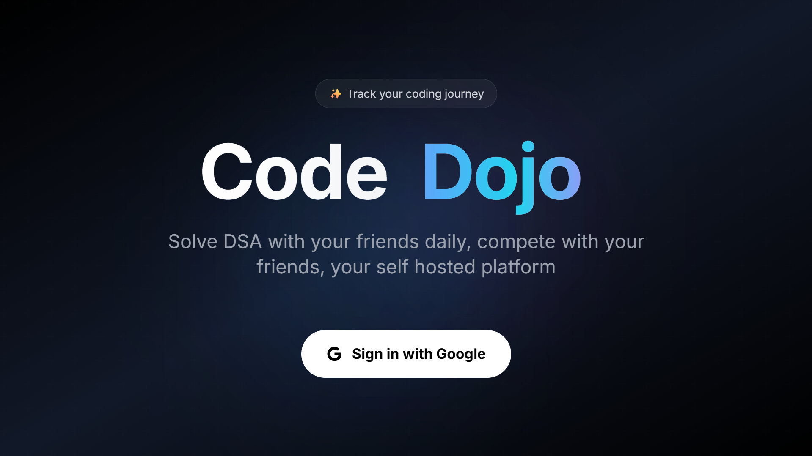
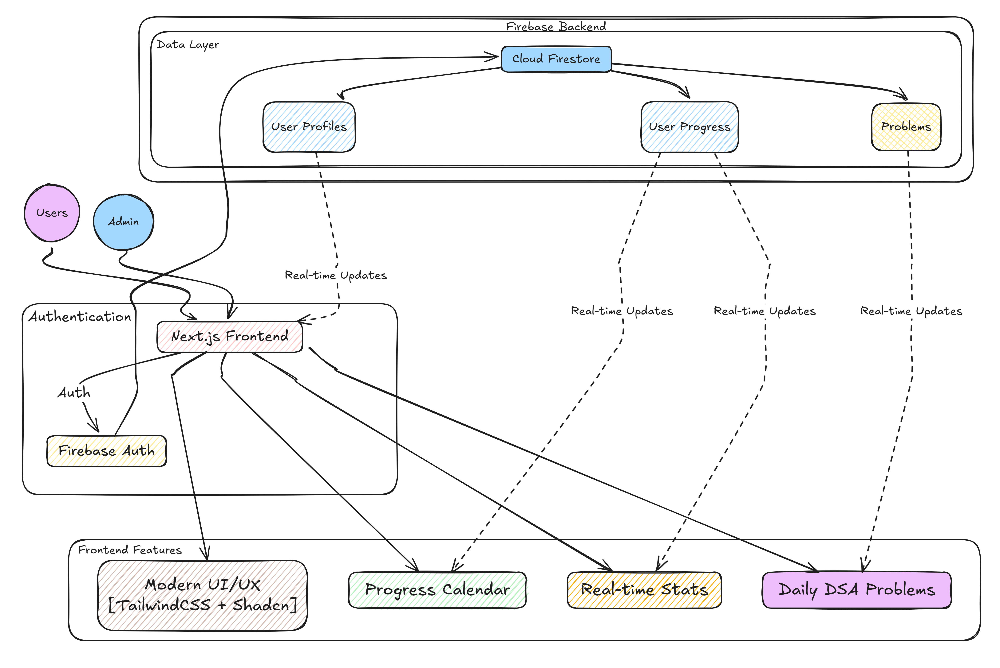

# Code Dojo - Daily DSA Hub for your peers

A self-hosted, collaborative platform for daily Data Structures and Algorithm (DSA) practice. Built with Next.js, Firebase, and modern web technologies.



[](https://github.com/mc095/dsa/blob/main/preview/dojo-fast.mp4)

## Architecture



The application follows a modern architecture with real-time updates and seamless integration between frontend and backend services. Built with scalability and maintainability in mind.

## Features

- 🎯 **Daily Problems**: Track and solve daily DSA problems
- 📊 **Progress Tracking**: Visual calendar and stats to monitor your progress
- 👥 **Multi-User Support**: Compete and collaborate with friends
- 📱 **Responsive Design**: Modern, clean UI that works on all devices
- 🔒 **Google Authentication**: Secure user authentication
- 📈 **Real-time Stats**: Track completion rates and streaks
- 👨‍💼 **Admin Dashboard**: Manage problems and user progress

## Tech Stack

- **Frontend**: Next.js, TypeScript, TailwindCSS, Radix UI
- **Backend**: Firebase (Auth, Firestore)
- **State Management**: React Context
- **UI Components**: Shadcn/ui
- **Authentication**: Firebase Google Auth

## Getting Started

### Prerequisites

- Node.js (v18 or higher)
- Firebase account
- Git

### Installation

1. Clone the repository:
```bash
git clone <your-repo-url>
cd code-dojo
```

2. Install dependencies:
```bash
npm install
```

3. Set up your Firebase configuration:
   - Create a new Firebase project
   - Enable Google Authentication
   - Create a Firestore database
   - Copy your Firebase config to `.env.local`:

```bash
NEXT_PUBLIC_FIREBASE_API_KEY=your_api_key
NEXT_PUBLIC_FIREBASE_AUTH_DOMAIN=your_auth_domain
NEXT_PUBLIC_FIREBASE_PROJECT_ID=your_project_id
NEXT_PUBLIC_FIREBASE_STORAGE_BUCKET=your_storage_bucket
NEXT_PUBLIC_FIREBASE_MESSAGING_SENDER_ID=your_messaging_sender_id
NEXT_PUBLIC_FIREBASE_APP_ID=your_app_id
```

4. Start the development server:
\`\`\`bash
npm run dev
\`\`\`

Visit [http://localhost:9002](http://localhost:9002) to see your app.

## Project Structure

- `src/app/` - Next.js app router and pages
- `src/components/` - Reusable UI components
- `src/firebase.ts` - Firebase configuration
- `src/types/` - TypeScript type definitions
- `src/hooks/` - Custom React hooks
- `src/services/` - Backend service functions

## Features in Detail

### User Dashboard
- View and track daily DSA problems
- Mark problems as completed
- View personal progress calendar
- Track solving streaks

### Admin Features
- Post new problems
- Monitor user progress
- Reset daily stats
- View detailed user statistics

### Progress Tracking
- Calendar view of activity
- Completion statistics
- User rankings
- Solving streaks

## Self-Hosting Manual

For detailed self-hosting instructions, visit:
[Self-Hosting Manual](https://mc095.github.io/jsonparser/self-hosting-manual)

